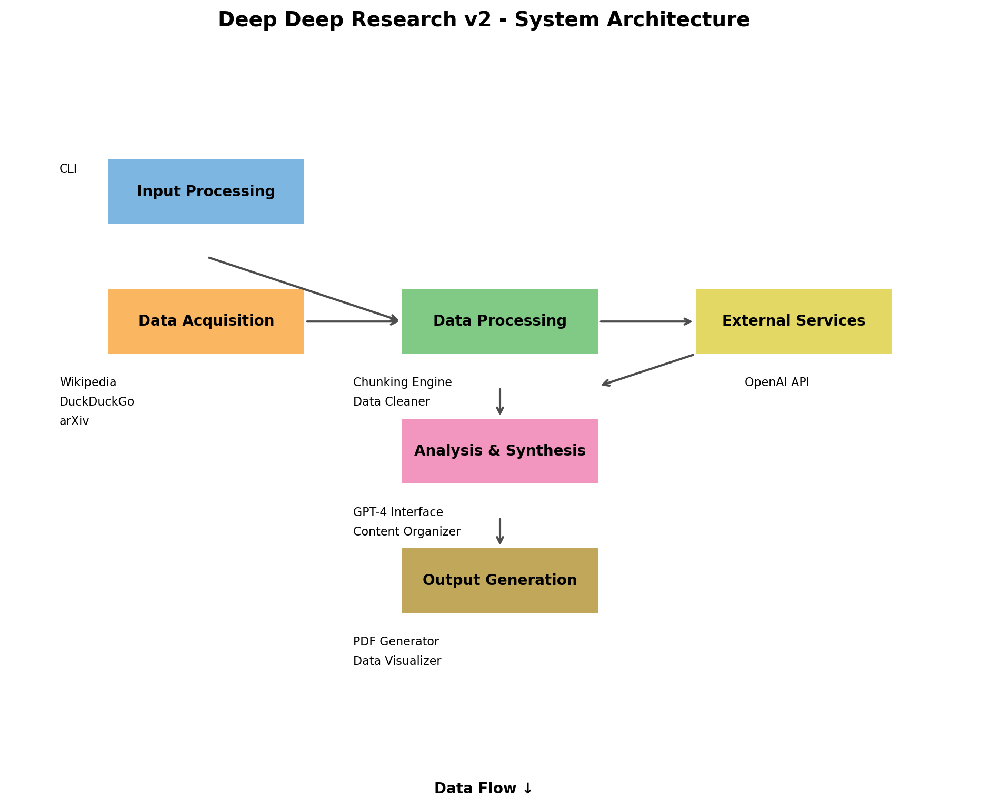

# Deep Deep Research v2 - System Architecture

## Overview

Deep Deep Research v2 is designed as a modular, extensible system that integrates multiple research sources to generate comprehensive reports. The architecture follows clean separation of concerns and emphasizes scalability to handle large volumes of data sources efficiently.

## Core Components



### 1. Input Processing

- **Command Line Interface (CLI)**: Entry point for initiating research tasks
- **Configuration Manager**: Handles environment variables and user preferences
- **Source Selector**: Determines which sources to use based on research depth

### 2. Data Acquisition

- **Source Adapters**:
  - Wikipedia Adapter: Fetches and processes Wikipedia data
  - DuckDuckGo Adapter: Performs web searches and retrieves results
  - arXiv Adapter: Accesses academic papers and extracts relevant content
  - OpenAI Web Search Adapter (optional): Additional source for web content

- **Source Manager**: Coordinates requests across multiple sources with rate limiting
- **Cache System**: Stores retrieved data to minimize redundant requests

### 3. Data Processing

- **Chunking Engine**: Splits large text into manageable chunks using advanced algorithms
- **Data Cleaner**: Normalizes, deduplicates, and structures raw data
- **Entity Extractor**: Identifies key entities, dates, and numerical data
- **Language Processor**: Handles multilingual content and translations

### 4. Analysis & Synthesis

- **GPT-4 Interface**: Manages interactions with OpenAI's GPT-4 Turbo
- **Content Organizer**: Structures content into coherent sections and hierarchy
- **Reference Manager**: Tracks and formats source citations
- **Data Validator**: Ensures factual consistency and accuracy

### 5. Output Generation

- **Content Generator**: Creates the final research document structure
- **PDF Generator**: Formats and renders reports as professional PDFs
- **Data Visualizer**: Creates charts and visual elements from research data
- **Multilingual Formatter**: Applies language-specific formatting rules

## Data Flow

1. **Research Initiation**:
   - User provides topic, depth level, and language preferences
   - System validates inputs and configurations

2. **Source Selection**:
   - Based on research depth (quick, standard, deep), the appropriate number of sources is determined
   - Sources are prioritized based on reliability and relevance

3. **Data Acquisition Process**:
   - Parallel requests to multiple sources
   - Rate limiting and error handling per source
   - Initial filtering for relevance

4. **Processing Pipeline**:
   - Raw text is chunked based on semantic boundaries
   - Data cleaning and normalization
   - Entity extraction and relationship mapping
   - Numerical data extraction and validation

5. **Synthesis**:
   - GPT-4 processes chunks to extract key insights
   - Content organization based on topic structure
   - Reference consolidation and formatting
   - Fact checking and validation

6. **Report Generation**:
   - Content structured according to standard research formats
   - Visualization creation from numerical data
   - PDF formatting with proper typography and layout
   - Multilingual adjustments applied if necessary

## API Interfaces

### Internal APIs

```
/api/research
  POST /start - Initiate research task
  GET /status/:id - Check research progress
  GET /result/:id - Retrieve research results

/api/sources
  GET / - List available sources
  POST /configure - Update source configurations
  
/api/pdf
  POST /generate - Create PDF from research data
```

### External Service Integrations

- **OpenAI API**: Using Chat Completions API for GPT-4 Turbo
- **DuckDuckGo API**: Search results retrieval
- **arXiv API**: Academic paper access
- **Wikipedia API**: Encyclopedia content access

## Scalability Considerations

- **Horizontal Scaling**: Component-based architecture allows distributed processing
- **Caching Strategy**: Multi-level caching for source data and intermediate results
- **Asynchronous Processing**: Event-driven architecture for parallel data acquisition and processing
- **Resource Management**: Adaptive limits on concurrent requests based on system resources

## Security Measures

- **API Key Management**: Secure handling of service credentials
- **Input Validation**: Thorough validation of all user inputs
- **Rate Limiting**: Protection against excessive requests
- **Data Sanitization**: Removal of potentially harmful content from source materials
- **Output Verification**: Ensuring generated content meets safety guidelines

## Error Handling and Resilience

- **Graceful Degradation**: System continues operation if individual sources fail
- **Retry Mechanisms**: Intelligent retry policies for transient failures
- **Comprehensive Logging**: Detailed logs for debugging and analysis
- **Fallback Options**: Alternative processing paths when primary methods fail

## Future Extensibility

- **Plug-in Architecture**: Support for additional source adapters
- **Custom Analysis Modules**: Framework for specialized domain-specific analysis
- **Alternative Output Formats**: Support for formats beyond PDF (e.g., HTML, DOCX)
- **Advanced Visualization**: Integration with specialized visualization libraries 